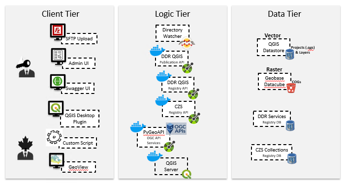
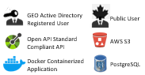
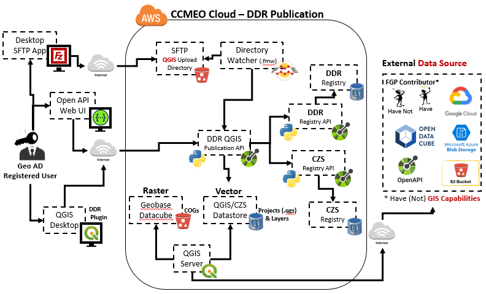
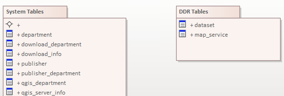

1. CDTK System overview
=======================

The CDTK (CCMEO Dissemination Tool Kit) is a flexible and portable geospatial data dissemination solution that combines two web-based applications:

* The **DDR** (Data Dissemination Repository)

  - Geospatial Data **Publication** Tool
  - internally accessible by Federal registered users
  
* The **CZS** (Clip, Zip and Ship)

  - Geospatial Data **Extraction** Tool
  - Publicly accessible	
  
The CDTK is based on Open Source technologies (QGIS, PostgreSQL,  PyGeoAPI, etc.) and deployed in AWS cloud using a microservice containerized approach. The DDR allows the publication of Web Services in compliance with OGC’s W*S and APIs Standards. The source geospatial data of these Web Services are mainly produced and stored internally (CCMEO data/datastores) but can also come from external (other Federal partners data/datastores).

The CDTK Architecture

   

1.1. DDR
--------

The DDR application allows to Publish, Update and Delete OGC WMS to
be served by QGIS Server. All its components are deployed in the FGP
Cloud infrastructure in AWS. There is 2 ways available for a user to
trigger the DDR publication process: Either by a Geo Active
Directory registered user (Federal Government user) that uploads an
Input Package to SFTP QGIS Upload Directory or by an NRCan AD user that
uses the DDR Publication QGIS Desktop plugin.

The DDR Workflow

Components
----------

SFTP QGIS Upload Directory and FME Directory Watcher
~~~~~~~~~~~~~~~~~~~~~~~~~~~~~~~~~~~~~~~~~~~~~~~~~~~~

This SFTP is a virtual directory linked to an AWS S3 bucket. A directory watcher Notification on FME Server is set to ping
the S3 bucket every minute. If anything new has been uploaded by a user
(:ref:`see how in this section<QGIS Desktop Plugin>`) to the bucket, the DDR_Directory_Watcher
(.fmw) FME workspace is triggered. The workspace receives and parses the
notification’s message (JSON) containing the information needed to call
the DDR QGIS Publication API.

QGIS Desktop Plugin
~~~~~~~~~~~~~~~~~~~

A WMS service development and deployment environment
^^^^^^^^^^^^^^^^^^^^^^^^^^^^^^^^^^^^^^^^^^^^^^^^^^^^

From QGIS Desktop on their local computer, Geo AD Users
can directly publish WMS services using the DDR Publication Plugin
(see how in this section). The plugin is a form with all the information
needed for the DDR Publication API to publish, update or delete a WMS
service. By using the "Validate" option, the users can
test that their projects (.qgs) is compliant with DDR publication process
guidelines before to publish it.

DDR QGIS Registry (DB, API and UI)
~~~~~~~~~~~~~~~~~~~~~~~~~~~~~~~~~~

Database
^^^^^^^^

The DDR QGIS Registry database allows to keep the integrity of the FGP
WMS services published via the DDR.

The DDR Registry Database Tables

API
^^^

The DDR QGIS Registry API (based on the OpenAPI standard) allows to
interact with the Registry DB via HTTP REST calls (url link to the API).
The API is accessed by the DDR QGIS Publication API (in the publication
processes) and by the DDR QGIS Registry Web UI.

UI
^^

The DDR QGIS Registry Web UI is a user-friendly interface to the DDR
QGIS Registry API. The DDR Admin GEO AD users can use the UI to browse or
manually edit records in the Registry DB. (url link to the UI).

DDR QGIS Publication API
~~~~~~~~~~~~~~~~~~~~~~~~

This API allows to Publish, Update or Delete WMS Services. When a WMS
service is:

-  Published, Updated or Deleted (P, U, or D)

   -  A record is P, U, or D to the DDR Registry (via the DDR Registry
      API)

   -  A CZS Open API can optionally be P, U, or D (via the CZS Registry
      API)

   -  A download folder can optionally be P, U, or D (via the DDR 1.0
      for first release?)

Depending on where the input comes from (Directory Watcher or QGIS
Desktop), the DDR Publication API performs the actions described below.

Input from Directory Watcher
^^^^^^^^^^^^^^^^^^^^^^^^^^^^

-  Move the Input Package File to a Linux Server (link to Input Package
   SOP)

-  Unzip the Input Package

-  Read the Control File (CF) (link to Control File SOP)

-  Validate that the information contained in the CF is suitable for the
   DDR operation (Publish, Update or Delete)

Input from QGIS Desktop Publication Plugin
^^^^^^^^^^^^^^^^^^^^^^^^^^^^^^^^^^^^^^^^^^

1.2. Clip Zip and Ship (CZS)
----------------------------

À remplir

