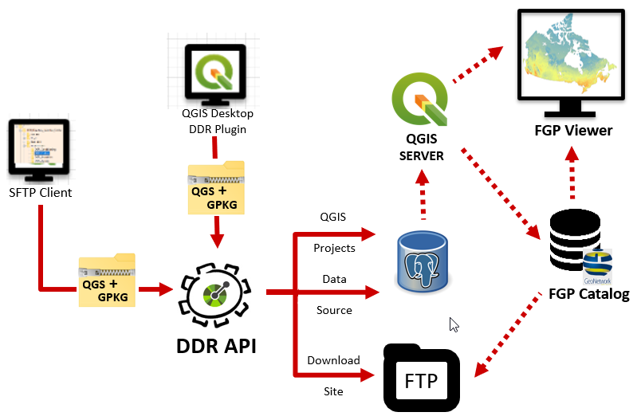

System overview
===============

The CDTK is based on the QGIS Server technology and produces web
services that follow the OGC standards. Vector datasets are stored in a
PostGIS database while raster datasets can be hosted on any source
available publicly on the internet.

-  Open-Source solution.

-  Containerized deployment in AWS Cloud.

-  Support for OGC W*S and OGC APIs Standards.

   1. .. rubric:: Workflow overview
         :name: workflow-overview

The CDTK…

2. .. rubric:: Infrastructure tiers
      :name: infrastructure-tiers

   1. .. rubric:: Client tier
         :name: client-tier

À remplir

Logic tier
----------

À remplir

Data tier
---------

À remplir

Clip-Zip-Ship
-------------