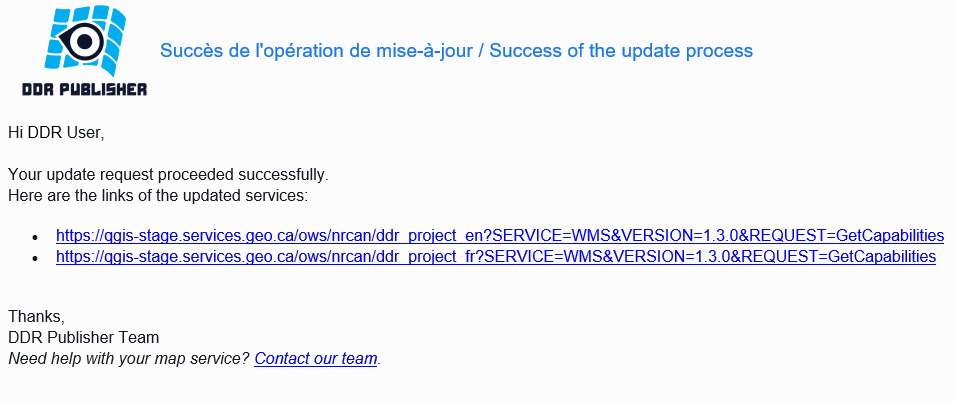

Using the results
=================

Access links
------------

Web services
~~~~~~~~~~~~

When a publication or update process completes successfuly, the user receives an email containing the links to the web services. 

Downloads directory
~~~~~~~~~~~~~~~~~~~

If the user added a download directory, the links to the downloadable files will be sent in a separate email.

Using an OGC web service
------------------------

The QGIS Servers are able to serve data according to strandard protocols as described by the **Open Geospatial Consortium (OGC)**. Extra vendor parameters and requests are supported in addition to the original standard that greatly enhance the possibilities of customizing its behavior thanks to the QGIS rendering engine. The followings protocols are available by default when publishing a service with the DDR:

	* WMS (Web Map Service) 1.1.1 and 1.3.0
	* WFS (Web Feature Service) 1.0.0 and 1.1.0
	* WCS (Web Coverage Service) 1.0.0 and 1.1.1
	* WMTS (Web Map Tile Service) 1.0.0
	
To get more information about the different protocols, refer to the `QGIS Server documentation`_.

.. _QGIS Server documentation: https://docs.qgis.org/3.28/en/docs/server_manual/services.html

GetCapabilities
~~~~~~~~~~~~~~~

The URL in the success email consists in the GetCapabilities request for the WMS protocol. It can be used to call the service within an application or map viewer. It can also be consulted as a XML in a web browser to get information about the structure and metadata of the web service.

The URL for the GetCapabilities is made of 5 different parts:

	* The base URL of the QGIS server.
	* The schema name in the PostGIS database (the provided department name).
	* The project name to access.
	* The protocol to be used (values are WMS/WFS/WCS/WMTS).
	* The desired version (depends on the protocol).
	* The request type (GetCapabilities)
	
	.. image:: media/getcap.png

GetMap
~~~~~~

The GetMap operation requests that the server generate a map. The core parameters specify one or more layers and styles to appear on the map, a bounding box for the map extent, a target spatial reference system, and a width, height, and format for the output. The information needed to specify values for parameters such as layers, styles and srs can be obtained from the Capabilities document. The response is a map image, or other map output artifact, depending on the format requested.

The standard parameters for the GetMap operation are:

+-------------+--------------------------------------------------------------------------------------------------------------------------------------+
| Parameter   | Description                                                                                                                          |
+=============+======================================================================================================================================+
| service     | Service name. Value is WMS.                                                                                                          |
+-------------+--------------------------------------------------------------------------------------------------------------------------------------+
| version     | Service version. Value is 1.1.1 or 1.3.0.                                                                                            |
+-------------+--------------------------------------------------------------------------------------------------------------------------------------+
| request     | Operation name. Value is GetMap.                                                                                                     |
+-------------+--------------------------------------------------------------------------------------------------------------------------------------+
| layers      | Layers to display on map. Value is a comma-separated list of layer names. Layers names can be found in the Capabilities document.    |
+-------------+--------------------------------------------------------------------------------------------------------------------------------------+
| styles      | Styles in which layers are to be rendered. Value is a comma-separated list of style names, or empty if default styling is required.  |
+-------------+--------------------------------------------------------------------------------------------------------------------------------------+
| srs or crs  | Spatial Reference System for map output. Value is in form EPSG:nnn. crs is the parameter key used in WMS 1.3.0.                      |
+-------------+--------------------------------------------------------------------------------------------------------------------------------------+
| bbox        | Bounding box for map extent. Value is minx,miny,maxx,maxy in units of the SRS.                                                       |
+-------------+--------------------------------------------------------------------------------------------------------------------------------------+
| width       | Width of map output, in pixels.                                                                                                      |
+-------------+--------------------------------------------------------------------------------------------------------------------------------------+
| height      | Height of map output, in pixels.                                                                                                     |
+-------------+--------------------------------------------------------------------------------------------------------------------------------------+
| format      | Format for the map output. `See supported output formats`_.                                                                          |
+-------------+--------------------------------------------------------------------------------------------------------------------------------------+

``Example: https://qgis-stage.services.geo.ca/ows/nrcan/ddr_project_en?SERVICE=WMS&VERSION=1.3.0&REQUEST=GetMap&LAYERS=layer1&STYLES=&CRS=EPSG:3978&BBOX=-2645312,-702646,3270311,3983398&WIDTH=1680&HEIGHT=818&FORMAT=image/png``

.. _See supported output formats: https://docs.geoserver.org/2.22.x/en/user/services/wms/reference.html

Other WMS Operations
~~~~~~~~~~~~~~~~~~~~

While most of the other operations available through the WMS standard are generally handled by the application used to consume the service, they can also be performed manually using a URL. Please refer to `this documentation`_ to learn more about the WMS operations.

+------------------+----------------------------------------------------------------------------------------------------------------------------+
| Operation        | Description                                                                                                                |
+==================+============================================================================================================================+
| GetCapabilities  | Retrieves metadata about the service, including supported operations and parameters, and a list of the available layers.   |
+------------------+----------------------------------------------------------------------------------------------------------------------------+
| GetMap           | Retrieves a map image for a specified area and content.                                                                    |
+------------------+----------------------------------------------------------------------------------------------------------------------------+
| GetFeatureInfo   | Retrieves the underlying data, including geometry and attribute values, for a pixel location on a map.                     |
+------------------+----------------------------------------------------------------------------------------------------------------------------+
| DescribeLayer    | Indicates the WFS or WCS to retrieve additional information about the layer.                                               |
+------------------+----------------------------------------------------------------------------------------------------------------------------+
| GetLegendGraphic | Retrieves a generated legend for a map.                                                                                    |
+------------------+----------------------------------------------------------------------------------------------------------------------------+

.. _this documentation: https://docs.geoserver.org/2.22.x/en/user/services/wms/reference.html